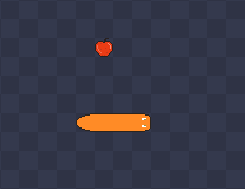

# Snake-Dungeon


 Snake game với các yếu tố rogue like được phát triển bằng Python và thư viện pygame-ce



## Lối chơi chính
- Người chơi điều khiển một con rắn, chiến đấu với những con rắn khác trên một bản đồ mở.  
- **Cơ chế chiến đấu**: Rắn có thể va chạm để hạ đối thủ, né tránh, hoặc cắt bớt thân mình để tạo chướng ngại vật.  
- **Cơ chế rogue-like**: Xuất hiện các vật phẩm hỗ trợ (buff) ngẫu nhiên, có thể nhặt hoặc mua trong shop.  
- **Hệ thống AI**: Rắn đối thủ sẽ có thuật toán di chuyển thông minh, né chướng ngại vật và tấn công theo chiến lược.  

## Yếu tố gameplay mở rộng
- **Boss đặc biệt**: Có ý tưởng về một con boss lấy cảm hứng từ logo Python – rắn song sinh.  
- **Hệ thống item**: Bao gồm tăng tốc, miễn tử một lần, nam châm hút vàng, tăng % né đòn, và buff trạng thái vô địch (cán mọi thứ trong 3s).  
- **Giải đố**: Một số phòng sẽ yêu cầu giải đố để tiếp tục tiến lên.  

## Yêu cầu
### Python modules
- `Python` >= 3.9
- `Pygame-ce` các module hỗ trợ thiết kế game
- `Pillow` sử lý ảnh

## Graphics
- `Pixilart` *https://www.pixilart.com/draw#*

## Cài đặt
```sh
# Clone repository
git clone https://github.com/JustAnother-12/Snake-Dungeon.git

# Cài đặt các dependency
pip install -r requirements.txt

# Chạy game
python src/main.py
```

## Thành viên
- `3123410349` *Nguyễn Bá Thiên*
- `3123560027` *Nguyễn Khắc Hiếu*
- `3123410413` *Phạm Văn Tuấn*